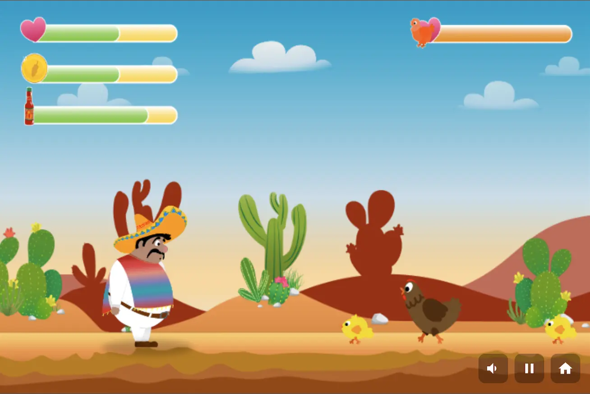

El Pollo Loco
=============

El Pollo Loco ist ein 2D Jump and Run für den Browser. Pepe bewegt sich durch eine scrollende Wüstenlandschaft, sammelt Münzen und Salsa Flaschen, weicht Gegnern aus und tritt am Ende gegen einen Endboss an. Die gesamte Spielwelt wird mit HTML, CSS und Vanilla JavaScript umgesetzt und über die HTML5 Canvas API gerendert.

## Überblick

Das Projekt entstand im Rahmen eines Frontend Kurses der Developer Akademie. Im Fokus stehen eine saubere objektorientierte Struktur, nachvollziehbare Spiellogik und ein vollständiger Spielablauf vom Startbildschirm bis zum Abschluss einer Partie. Die Anwendung kommt ohne Framework und ohne Build Prozess aus.

## Spielinhalt

1. Ein vollständiges Level mit Kamera Bewegung und mehrschichtigem Hintergrund.
2. Eine Spielfigur mit Lauf, Sprung, Treffer, Tod und Ruheanimationen.
3. Sammelobjekte für Münzen und Salsa Flaschen mit separaten Statusleisten.
4. Eine Wurfmechanik mit Flugbahn, Aufprallanimation und Trefferlogik.
5. Gegner vom Typ Huhn, kleines Huhn und ein Endboss mit eigener Lebensanzeige.
6. Startbildschirm, Pausebildschirm, Gewinnbildschirm und Verlustbildschirm.
7. Soundeffekte, Hintergrundmusik, Vollbildmodus und mobile Touchsteuerung.

## Spielablauf

Pepe durchquert eine lineare Spielwelt, sammelt Ressourcen und nutzt eingesammelte Flaschen als Wurfwaffe. Normale Gegner lassen sich zusätzlich durch einen Sprung von oben besiegen. Im letzten Abschnitt des Levels wird der Endboss aktiviert. Ab diesem Moment erscheint eine eigene Bossanzeige und das Spiel wechselt sichtbar in die Abschlussphase des Levels.

## Steuerung

1. Pfeil links bewegt Pepe nach links.
2. Pfeil rechts bewegt Pepe nach rechts.
3. Leertaste lässt Pepe springen.
4. D wirft eine eingesammelte Salsa Flasche.
5. P oder Escape pausiert das Spiel oder setzt es fort.
6. Auf Touch Geräten stehen eigene Tasten für Bewegung, Sprung und Wurf bereit.

## Technische Umsetzung

Die Oberfläche besteht aus einem Canvas für das eigentliche Spielgeschehen sowie ergänzenden HTML Elementen für Overlays, Modale Fenster und Bedienelemente. Das Styling übernimmt CSS mit separaten Dateien für Buttons, Overlays, Vollbilddarstellung, Touchsteuerung und Responsive Anpassungen. Die Spiellogik ist vollständig in Vanilla JavaScript umgesetzt und in eigenständige Klassen aufgeteilt.

Zentrale Verantwortlichkeiten sind klar getrennt. World steuert Renderzyklus, Kamera, Statusleisten, Würfe und die Erzeugung neuer Gegner. Character verwaltet Bewegung, Sprungverhalten, Animationen und Spielfeedback. CollisionHandler übernimmt die Kollisionserkennung zwischen Figur, Gegnern, Münzen, Flaschen und Wurfobjekten. Die Leveldefinition legt fest, welche Gegner, Wolken und Sammelobjekte im Level vorhanden sind.

## Projektstruktur

1. index.html enthält die Spieloberfläche, Overlays, Modale Fenster und den Canvas Einstieg.
2. js enthält den globalen Spielstart sowie Sound, Eingaben, Touchsteuerung und Fullscreen Logik.
3. classes enthält die komplette objektorientierte Spiellogik.
4. levels definiert die Inhalte des Levels.
5. css enthält Layout, Buttons, Overlays, Media Queries und mobile Anpassungen.
6. audio und img enthalten die Assets für Sound, Figuren, Hintergründe und Benutzeroberfläche.
7. legal enthält das Impressum.

## Voraussetzungen und lokaler Start

Für den Start sind keine externen Pakete oder zusätzlichen Build Schritte nötig. Ein moderner Browser genügt.

1. Repository klonen oder als ZIP herunterladen.
2. Projektordner in einem Editor wie VS Code öffnen.
3. index.html direkt im Browser öffnen oder das Projekt über einen lokalen Server wie Live Server starten.
4. Im Startbildschirm auf START klicken und das Spiel beginnen.

## Besondere Punkte der Umsetzung

1. Die Spielfigur besitzt eine spürbare Sprungvorbereitung, wodurch Eingabe und Animation besser zusammenwirken.
2. Der Bosskampf startet erst bei Annäherung und blendet dynamisch eine eigene Statusleiste ein.
3. Das Spiel unterstützt Desktop und Touch Geräte innerhalb derselben Oberfläche.
4. Die Toneinstellung bleibt auch nach einem Neuladen der Seite erhalten.
5. Auf mobilen Geräten ist das Spiel für das Querformat ausgelegt.

## Autor

Lee Roy Romann

Entwickelt im Rahmen eines Frontend Projekts der Developer Akademie.

## Lizenz

Für dieses Repository ist aktuell keine separate Open Source Lizenzdatei hinterlegt.

## Quellen und Hinweise

1. Das Projekt wurde als Lernprojekt im Rahmen der Developer Akademie entwickelt.
2. Rechtliche Hinweise, Angaben zum Urheberrecht und Informationen zu externen Ressourcen befinden sich im Impressum unter [legal/impressum.html](legal/impressum.html).
3. Im Impressum wird Google Fonts als externe Ressource genannt.